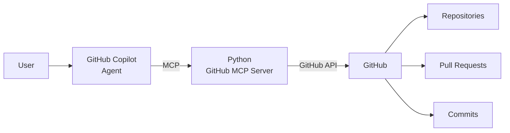

# GitHub MCP Server

A Python-based **Model Context Protocol (MCP) server** that lets AI agents interact with GitHub through structured tools. It connects the GitHub API with MCP clients such as **GitHub Copilot Agent**, enabling natural-language access to repositories, pull requests, and commits.

## Overview

This project demonstrates how MCP can connect an AI agent to GitHub without putting GitHub API logic directly inside the agent.

### Architecture



## Features

* GitHub API integration through MCP
* Repository, pull request, and commit tools
* GitHub Copilot Agent integration
* MCP Inspector support
* Environment-based authentication

## Available Tools

| Tool                 | Description                   |
| -------------------- | ----------------------------- |
| `list_repositories`  | List available repositories   |
| `get_repository`     | Get repository details        |
| `list_pull_requests` | List repository pull requests |
| `get_pull_request`   | Get pull request details      |
| `list_commits`       | List repository commits       |
| `get_commit`         | Get commit details            |

## Example Requests

With the server connected to Copilot Agent:

```text
List my GitHub repositories.
```

```text
Show me the open pull requests in alibro005/CardioPredict.
```

```text
Show me the latest 5 commits in alibro005/CardioPredict.
```

Copilot selects the appropriate MCP tool, retrieves the data through the server, and returns the result in natural language.

## Tech Stack

* Python
* Model Context Protocol (MCP)
* GitHub REST API
* GitHub Copilot
* MCP Inspector
* VS Code

## Project Structure

```text
github-mcp-server/
│
├── .vscode/
│   └── mcp.json
├── server.py
├── requirements.txt
├── .env
├── .gitignore
└── README.md
```

## Setup

### 1. Clone the repository

```bash
git clone https://github.com/alibro005/github-mcp-server.git
cd github-mcp-server
```

### 2. Create a virtual environment

```bash
python -m venv .venv
```

Windows:

```powershell
.venv\Scripts\activate
```

Linux/macOS:

```bash
source .venv/bin/activate
```

### 3. Install dependencies

```bash
pip install -r requirements.txt
```

### 4. Configure GitHub authentication

Create a `.env` file:

```env
GITHUB_TOKEN=your_github_token
```

Keep your token private and add `.env` to `.gitignore`:

```gitignore
.env
.venv/
__pycache__/
```

## Testing

### MCP Inspector

Test the server independently with:

```bash
npx @modelcontextprotocol/inspector python server.py
```

This verifies tool discovery, execution, and GitHub API responses.

### GitHub Copilot Agent

The server was also tested with **GitHub Copilot Agent in VS Code** to verify the complete workflow:

```text
User → Copilot Agent → MCP Server → GitHub API → Response
```

## Future Improvements

* GitHub issue management
* Pull request creation and updates
* Automated PR reviews
* Commit and diff analysis
* Repository search
* AI-generated PR summaries
* GitHub Actions integration

## Project Outcome

A working MCP integration that allows an AI agent to interact with GitHub using reusable, structured tools instead of directly handling GitHub API operations.

## License

This project is licensed under the [MIT License](LICENSE).
